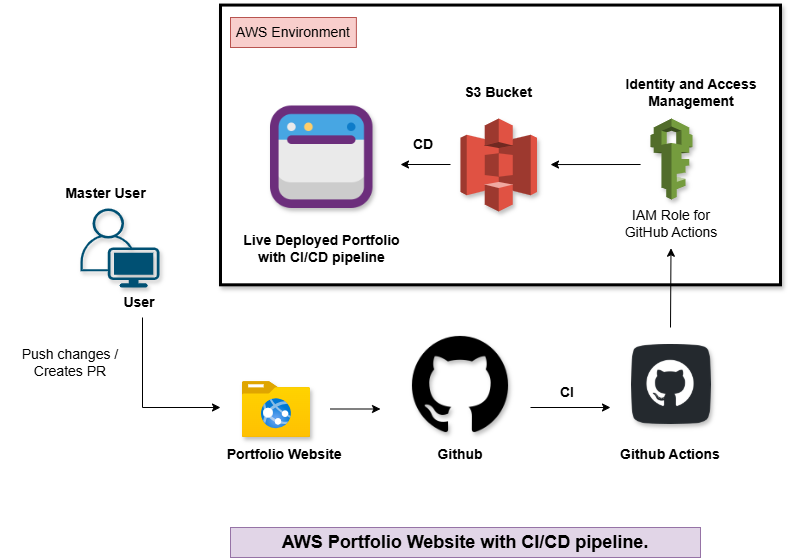

# 🚀 AWS Portfolio Website with CI/CD Pipeline



## 📌 Overview
This project demonstrates a fully automated **CI/CD pipeline** for deploying a portfolio website using **AWS services and GitHub Actions**.  

Whenever code is pushed to GitHub, the pipeline automatically builds and deploys the website to an AWS S3 bucket, making it live without manual intervention.

---

## 🏗️ Architecture
The system follows a modern DevOps workflow:

1. 👨‍💻 Developer pushes code to GitHub
2. ⚙️ GitHub Actions triggers CI/CD pipeline
3. 🔐 IAM Role provides secure AWS access
4. ☁️ AWS S3 hosts the static website
5. 🌐 Website is deployed and accessible to users

---

## 🛠️ Tech Stack

- **Frontend:** HTML, CSS, JavaScript  
- **Version Control:** GitHub  
- **CI/CD:** GitHub Actions  
- **Cloud:** AWS S3  
- **Security:** AWS IAM Roles  

---

## 🔄 CI/CD Workflow

### Continuous Integration (CI)
- Code pushed to GitHub
- GitHub Actions workflow triggers
- Project is built and validated

### Continuous Deployment (CD)
- AWS credentials accessed via IAM Role
- Files uploaded to S3 bucket
- Website updated automatically

---

## 📁 Project Structure
AWS-Portfolio-CICD-Pipeline/
│
├── .github/
│   └── workflows/
│       └── deploy.yml              # GitHub Actions CI/CD pipeline
│
├── website/
│   ├── src/
│   │   ├── img/                   # Images (profile, project, architecture)
│   │   │   ├── harindra.jpg
│   │   │   ├── aws-architecture.png
│   │   │   ├── port1.png
│   │   │   └── ...
│   │   │
│   │   ├── styles/                # CSS files
│   │   │   └── style.css
│   │   │
│   │   ├── app.js                 # Main JavaScript
│   │   └── index.html            # Main HTML file
│   │
│   └── dist/                     # (Optional) Build output for deployment
│
├── README.md                     # Project documentation
├── package.json                  # (If using npm / build tools)
└── .gitignore


---

## ⚙️ Setup Instructions

### 1️⃣ Clone Repository
```bash
git clone https://github.com/your-username/AWS-Portfolio-CICD-Pipeline.git
cd AWS-Portfolio-CICD-Pipeline

2️⃣ Configure AWS S3
Create an S3 bucket
Enable static website hosting
Set bucket policy for public access

3️⃣ Setup IAM Role
Create IAM Role for GitHub Actions
Attach S3 full access policy
Configure trust relationship with GitHub

4️⃣ Configure GitHub Actions
Add AWS credentials as GitHub Secrets:
AWS_ACCESS_KEY_ID
AWS_SECRET_ACCESS_KEY

5️⃣ Deploy

Push code:

git add .
git commit -m "Deploy portfolio"
git push origin main

